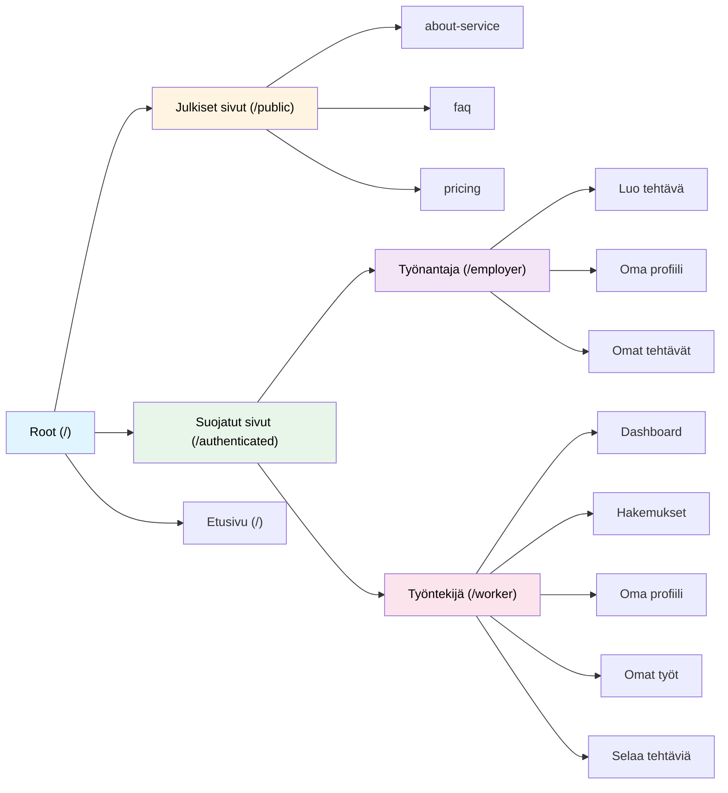

# Seminaarityö: Modernin Web-sovelluksen reititys hyödyntäen Tanstack Routeria

Tämä dokumentti kuvaa seminaarityönä toteutetun web-sovelluksen reitityksen tavoitteet, toteutuksen ja teknologiavalinnat. Projektin pohjana käytetään Ohjelmistoprojekti 2 -kurssin repositorya ja sen lähdekoodia. Seminaarityötä varten on luotu oma branch, jota ei yhdistetä dev -branchiin, mutta mahdollisia osia poimitaan routerin dokumentaatiota varten tulevaiuudessa. Raportissa kuvaillaan työn eri vaiheita, haasteita, omia mietteitä ja mahdollisia kehityskohteita tulevaisuuta varten, sekä esitellään kuvia ja kaavioita liitteyn routeriin. Lisäksi ollaan pohdittu omaa oppimista työn tekemisen aikana ja kuvailtu paljon aikaa kului kuhunkin vaiheeseen.

## 1. Tavoitteet

Tavoitteena oli rakentaa sovellukselle optimaalinen toteutus reititykseen liittyen. Tässä päädyttiin TanStackin routeriin, koska TanStackilla reitityksen toteutus palveli parhaiten web-sovelluksemme tarpeita, käyttää vahvaa tyypitysta ja typescript tuki, sekä omaa kattavan määrän erilaisia toiminnallisuuksia jotka palvelevat projektia. Alla listauksena tavoitteet joita asetin liittyen reititykseen ennen toteutuksen aloittamista:

- **Selkeä URL-rakenne:** Luodaan loogiset ja käyttäjäystävälliset URL-osoitteet (esim. `/profiili`, `/tehtavat/$id`).
- **Dynaamiset ja parametrisoidut reitit:** Mahdollistetaan yksittäisten resurssien näyttäminen URL-parametrien avulla.
- **Suojatut reitit:** Mahdollista näyttää hauluttuja reittejä/sivuja vain autentikoituneille käyttäjille.
- **Skaalautuvuus:** Skaalautuu erinomaisesti ja projektin laajentuessa, reittien lisääntyessä, ei kehittäjien tarvitse huolehtia ja keskittyä reitityksen jatkuvaan päivittämiseen.

Vaikka yllä on listaus mainitsemistanu tavoitteista **ennen** työn aloittamista, lopullisessa työssä on kuitenkin useampia ominaisuuksia joita en työn alussa tiennyt/osannut toteuttaa.

## 2. Toteutus ja Arkkitehtuuri

### Reittihierarkia (Puukaavio)

Tarkempi kaavio: [ROUTING.md](ROUTING.md)

### 2.1 Tutoriaalit ja dokumentaatiot

Työn alkuvaiheessa tutustuin [TanStack Router](https://tanstack.com/router/latest/docs/framework/react/overview) -dokumentaatioon, [tiedostopohjaiseen reititykseen](https://tanstack.com/router/latest/docs/framework/react/routing/file-based-routing) ja sen tarkoitukseen/toteutukseen, sekä erilaisten YouTube -videoiden katsomiseen oli osana arkea, ennen kuin kirjoitin pätkääkään koodia. Tarkoituksena oli saada kattava kokonaiskuva mitä reitittimellä on mahdollista tehdä ja miten erilaiset vaatimukset jotka oli ennalta määritelty (autentikoituneen käyttäjän reitit, hakemistorakenne yms.) oli mahdollista toteuttaa. Arviolta 15-20h [Esimerkki-projekteja](https://tanstack.com/router/latest/docs/framework/react/examples/quickstart-file-based?panel=code) TanStackin dokumtaatioista silmäillen ja alustaen omaan haaraan samoja asioita sekä tekoälyn kanssa konsultoidessa taustalla, alkoi ymmärtämään routerin sielunelämää paremmin, jolloin pystyin aloittamaan reittien suunnittelun.

### 2.2 Reittien suunnittelu

Reittien suunnittelu pohjautui hyvin pitkälti Figmassa toteuttamaani, yhdessä ryhmän kanssa suunniteltuihin esimerkki-sivuihin, joissa oli määritelty yhdessä millaisia sivuja ja näkymiä käyttöliittymässä olisi syytä olla. Tämän ja TanStackin dokumentaatioiden avulla lähdin suunnittelemaan perinteisellä kynä & paperi menetelmällä (joka oli korvattu tässä tapauksessa ipadilla ja kynällä), hakemistorakennetta johon kuului kansiot, "pathless reitit" esim. \_authenticated, index -sivut ja parametrilliset sivut. Suunnittelin tulevaisuutta varten sivuja jotka näkyivät suunnitelmissa, vaikkei niille ollut olemassa toiminnallisuutta vanhassa routerissa. Suunnittelun jälkeen päästiin määrittelemään konfiguraatioita.

### 2.3 Konfiguraatioiden määrittelyt

Homma alkoi asentamalla paketit "npm install @tanstack/react-router" -komennolla komentokehotteessa. Konfiguraatiot [vitelle](https://tanstack.com/router/latest/docs/framework/react/installation/with-vite) tapahtui pääsääntöisesti TanStackin ohjeiden mukaan ja hyödynsin niillä ihan puhtaasti aika-ajoittain copy & paste menetelmää. Käytin myös esimerkkiprojektin [Basic + React Query (file-based)](https://tanstack.com/router/latest/docs/framework/react/examples/basic-react-query-file-based) lähdekoodia mallina ja kopioin osan sieltä, koska on vaikea keksiä pyörää uudestaan tämän asian tiimoilta. Lisäksi kävin tekoälyn kanssa läpi erilaisia kohtia ja se selvensi niiden tarkoitusta routerin toiminnassa.

### 2.4 Kansiorakenteen toteutus

Seuraavaksi kun suunnitelmat oli tehty ja routerin sielunelämä oli ymmärretty, meni arviolta 3-5 tuntia tykittää vain kansioita ja tiedostoja /routes kansioon, jonka pohjalta routeTree.gen.tsx -generoituu itsekseen. Tämä tiedosto on lähteenä routeTree:lle joka importoidaan myöhemmin main.tsx -tiedostossa. Jokaisen luodun tiedoston ohella TanStack luo automaattisesti renderöitävän komponentin ja reitin [example](./frontend/workerfrontend/src/routes/example/example.tsx), joka automatisoi ja nopeuttaa ohjelmointia sekä tekee siitä sujuvampaa (mielipide pohjautuu omaan kokemukseen). Huomoitavaa on se että sovelluksen on oltava käynnissä jotta se generoi uusia reittejä. Kansiorakenteen luominen oli pidemmän päälle kansioiden ja tiedostojen jyystämistä jonka jälkeen tein commitin ja etenin siirtämään olemassa olevia komponentteja reiteille.

### 2.5 Reitityksen toiminnallisuuden toteutus

Sitten aloin siirtämään [pages](./frontend/workerfrontend/src/pages/) -sivulta komponentteja niille oikeille paikoilleen. Alkuun koin tämän vaiheen työlääksi, koska en voinut käyttää suoraan hookeja, koska hookeja voidaan käyttää vain toisissa hookeissa tai komponentin sisällä, hyödyntäessä TanStackin [loader](https://tanstack.com/router/latest/docs/framework/react/guide/data-loading#route-loaders) ominaisuutta, tämä tarkoittaa että joudun jokaisesta hookista luomaan oman queryn [queries](/frontend/workerfrontend/src/features/task/queries/taskQueries.tsx) tiedostoon esimerkkinä taskin queries kansiossa sijaitseva taskQueries -tiedosto. Lisäksi React queryn ja välimuistituksen ymmärtäminen tuotti haasteita, mutta toistojen kautta tämäkin ymmärrettiin. Alun opettelun jälkeen tämä oli aika toisteista suorittamista loppuajan, koska kaikki toteutettiin samaan tyyliin, paitsi data joka tarvitsi parametrin esim. id-arvo. Toinen "työläs" asia oli että jouduin pilkkomaan ismopia komponentteja pienemmiksi kokonaisuuksiksi, koska reitityksessä oli erikseen esimerkiksi $id/details ja $id/details/edit, jolloin kaikkia ominainuuksia, stateja ja importteja ei tarvittu molemmissa sivuissa, vaikka olivat alkuun vain yksi komponentti. Lisäksi kaikki ehtolausekkeet jotka sisälsivät esimerkiksi isloading, error, tai vastaavaa pystyi poistamaan, koska nämä voidaan määrittää reitin oletuskomponenteissa esimerkiksi [Not Found Error](https://tanstack.com/router/latest/docs/framework/react/guide/not-found-errors#notfoundmode-fuzzy). Toisaalta tämä oli hyvää harjoitusta itselle silmäillä ja ymmärtää koodia, samalla poistaen turhaksi jääneitä asioita.

### 2.6 Contextin hyödyntäminen Auth0:n kanssa ja reittien suojaus

Alkuun totesin etten kykene hyödyntämään Auth0:n JWT, koska se täytyy hakea hookin avulla palveluntarjoajalta ja toteutin datan hakemisen osassa sivuissa komponentin renderöidyttyä. Tämä ajatus kuitenkin murskattiin kun perehdyin lisää TanStackin ominaisuuksiin esimerkiksi [Authenticated Routes](https://tanstack.com/router/latest/docs/framework/react/examples/authenticated-routes) ja [Auth0 integration](https://tanstack.com/router/latest/docs/framework/react/how-to/setup-auth-providers#2-set-up-environment-variables) -dokumentaatioiden, sekä tekoälyn avustuksella. Lähdin toteuttamaan contextin ja wrapperin luomista ihan vain suoraan kopioimalla tämän lähdekoodin aiemmin mainitsemistani lähteistä, samalla muokaten sitä omaan projektiin sopivammaksi. Loin [auth0.tsx](/frontend/workerfrontend/src/auth/auth0.tsx) -tiedoston johon loin dokumentaatioiden avulla Wrapperin jota käytin sovelluksen käärimiseen. Lisäksi dokumentaatioiden avulla sain hookin joka palautti contextin, jonka syötin sitten RouterProvider -komponentille ja mahdollistin contextin sisältämien funktioiden käyttämisen reitittimessä ennen komponentin renderöitymistä. Kaiken tämän jälkeen sain contextista haettua funktion joka palauttaa Promise<String> joka on AccessToken, syötin tämän funktion funktiolleni jota queryni käyttää henkilökohtaisen datan hakemiseen api-endpointista. Opettelun ja konfiguroinnin jälkeen loppu oli aikalailla saman funktionaalisuuden toistamista muiden reittien luonnin yhteydessä. Olen suojannut kaikki [\_authenticated](/frontend/workerfrontend/src/routes/_authenticated/) alkuiset reitit, joten niiden käyttäminen vaatii käyttäjän autentikoinnin. Tähän funktionaalisuus löytyy [\_authenticated.tsx](/frontend/workerfrontend/src/routes/_authenticated.tsx) -tiedostosta.

### 2.7 Routerin käyttöönotto ja ohjeistus

Lopuksi testasin kaikkien sivujen toimivuuden, että kaikki luodut sivut renderöityvät, data sivuilla haetaan ja välimuistitetaan ehtojen mukaisesti, CRUD-ominaisuudet toimivat normaalisti. Seurailin myös selaimen development toolsissa network välilehteä välimuistituksen ja muiden bugien varalta. Todettaessa että lopputulos on projektin tavoitteiden mukainen, vaikkakaan kaikkia ominaisuuksia ei saanut toteutettua tähän hätään, voitiin commitit mergetä dev -haaraan. Tämän jälkeen viikkopalaverissa neuvoin ja esittelin uuden reitityksen ominaisuuksia, kuinka uusia reittejä luodaan, loaderin käyttöä ja queries kansioiden sisältöä ja päivittämistä. Tämän ohjeistuksen tarkoituksena oli varmistaa ja mahdollistaa että kehittäjät pääsevät luomaan omia ominaisuuksiaan normaalisti, samalla toteuttaen reitityksen hyviä käytäntöjä.

## 3. Teknologiavalinnat

Tässä osiossa käydään läpi projektissa käytetyt keskeisimmät teknologiat ja perustelut niiden valinnalle.

### 3.1. Käyttöliittymäkirjasto: React

[React](https://react.dev/) valittiin projektin käyttöliittymäkirjastoksi useista syistä. Haaga-Heliassa olemme pääsääntöisesti käyttäneet Reactia opintojen aikana, joten koko tiimillä oli jo valmiiksi hyvä ymmärrys sen toiminnasta ja parhaista käytännöistä. Tämä mahdollisti nopean kehityksen aloittamisen ilman pitkää opetteluvaihetta. React tarjoaa komponenttipohjaisen arkkitehtuurin, joka sopii erinomaisesti modernien web-sovellusten kehitykseen. Lisäksi Reactin laaja ekosysteemi ja yhteensö tarjoavat runsaasti valmiita kirjastoja ja ratkaisuja yleisiin ongelmiin.

### 3.2. Ohjelmointikieli: TypeScript

[TypeScript](https://www.typescriptlang.org/) valittiin ohjelmointikieleksi sen tarjoaman tyypityksen vuoksi. Tyypitys auttaa havaitsemaan virheet jo kehitysvaiheessa ennen koodin suorittamista, mikä vähentää tuotantovirheitä ja parantaa koodin laatua. TypeScriptin automaattinen koodin täydennys (IntelliSense) nopeuttaa kehitystyötä ja tekee koodista helpommin ylläpidettävää.

### 3.3. Rakennustyökalu: Vite

[Viteä](https://vite.dev/) olemme käyttäneet Haaga-Helian opintojen aikana frontend-rakennustyökaluna, joten päädyimme myös nyt siihen.

### 3.4. Reititys: TanStack Router

[TanStack Router](https://tanstack.com/router/latest) valittiin projektin reitittimeksi sen monipuolisten ominaisuuksien ja modernin lähestymistavan vuoksi. Reititin tarjoaa täyden TypeScript-tuen, mikä tekee reitityksestä tyyppiturvallista ja virheiden havaitsemisesta helppoa jo kehitysvaiheessa.

**Keskeiset ominaisuudet ja valintaperusteet:**

- **Tiedostopohjainen reititys:** Automaattinen reittien generointi kansiorakenteen perusteella vähentää boilerplate-koodia ja tekee reitityksestä intuitiivista. Tämä jättää enemmän aikaa sovelluksen ydinominaisuuksien kehittämiselle, ilman että reititystä täytyisi jatkuvasti päivittää. Lisäksi kansiorakenne sivuille muodostuu loogiseksi.
- **Datan esilataus:** Loader-toiminnallisuus mahdollistaa datan lataamisen ennen komponentin renderöintiä, mikä parantaa käyttäjäkokemusta ja suorituskykyä.
- **Type-safe reititys:** Reittiparametrit, search-parametrit ja muut reittiin liittyvät tiedot ovat täysin tyypitettyjä. Kun määrittelemmme esimerkiksi navigate({ to: "/reitti"}), ehdottaa automaattisesti olemassa olevia reittejä, [kuva](/pics/routes-type-script-1.png). Samoin jos reitin kirjoittaa väärin tai ne muuttuvat, niin TypeScript tuki huomaa virheen ja ilmoittaa käyttäjälle, [kuva](/pics/routes-type-script-2.png).
- **Auth-integraatio:** Suojattujen reittien toteuttaminen on suoraviivaista context-pohjaisen autentikoinnin avulla. Sekä kattava dokumentointi, myös muille autentikointi -palveluntarjoajille.
- **TanStack Query -integraatio:** Routerin ja Queryn saumaton yhteistyö mahdollistaa tehokkaan datan hallinnan ja välimuistituksen.
- **Lataus- ja virhetilojen hallinta:** Tarjoaa yksinkertaisen tavan hallita latausindikaattoreita ja virheilmoituksia.

### 3.5. Datanhallinta: TanStack Query (React Query)

[TanStack Query](https://tanstack.com/query/latest) (aiemmin React Query) valittiin projektin datan hallintakirjastoksi sen tehokkaiden välimuisti- ja tilan hallintaominaisuuksien vuoksi. Se yksinkertaistaa merkittävästi asynkronisen datan hakemista, päivittämistä ja välimuistittmista.

**Keskeiset hyödyt:**

- **Automaattinen välimuistitus:** Haettu data tallennetaan automaattisesti välimuistiin, mikä vähentää turhia API-kutsuja ja parantaa suorituskykyä.
- **Background refetching:** Data päivittyy automaattisesti taustalla, mikä varmistaa että käyttäjä näkee aina ajantasaista tietoa.
- **Optimistic updates:** Mahdollistaa käyttöliittymän päivittämisen välittömästi ennen API-kutsun valmistumista, mikä parantaa käyttäjäkokemusta. Eli jos päivitetään käyttöliittymässä nimeä niin se päivittyy heti käyttöliittymään, jos fetch epäonnistuu, palautuu vanha arvo takaisin.

TanStack Query integroituu täydellisesti TanStack Routerin kanssa, mikä mahdollistaa datan esilatauksen reittitasolla loader-toiminnallisuuden avulla. Tämä yhdistelmä luo tehokkaan ja käyttäjäystävällisen datan hallintajärjestelmän.

### 3.6. Autentikointi: Auth0

[Auth0](https://auth0.com/) valittiin projektin autentikointiratkaisuksi, koska halusimme ulkoistaa tämän osuuden ohjelmoinnista palveluntarjoajalle ja Auth0 oli entuudestaan tuttu. Myös kattavat dokumentaatiot ja free-tier, oli iso syy että päädyttiin tähän. Se että onko auth0 lopullinen ratkaisu projektimme autentikoimmin hoitamiseen, ei ole varmaa.

**Keskeiset ominaisuudet:**

- **Monipuoliset kirjautumismenetelmät:** Tukee sosiaalisia kirjautumisia (Google, GitHub, jne.), käyttäjätunnus/salasana -kirjautumista ja monivaiheista tunnistautumista.
- **JWT-tokenien hallinta:** Tarjoaa turvallisen tavan hallita käyttäjän istuntoja ja API-kutsujen valtuutusta JSON Web Tokenien avulla.
- **Valmiit UI-komponentit:** Auth0:n Universal Login -ominaisuus tarjoaa turvallisen ja muokattavan kirjautumissivun.
- **Kehittäjäystävällisyys:** Kattavat dokumentaatiot ja valmiit SDK:t (kuten @auth0/auth0-react) nopeuttavat integrointia.
- **Turvallisuus:** Auth0 huolehtii turvallisuuspäivityksistä ja noudattaa alan parhaita käytäntöjä, mikä vähentää tietoturvariskejä. Toisin kuin jos itse hoitaisi autentikoinnin ja turvallisuus on tärkeä osa ohjelmistoa.

## 4. Oppimiskokemus ja Pohdinta

Jos kysytään, millainen oppimiskokemus tämä parin viikon rupeama TanStack Routerin kanssa oli, niin vastaisin että se antoi paljon ja kävisin sen matkan uudelleen. Arviolta 40-50 tuntia yhteensä aiheen parissa käyttäneenä, oppi välimuistittamaan dataa selaimeen, tiedosto-pohjaisen reitityksen toiminnan sekä rakentamaan toimivan ja skaalautuvan reitityksen jota muiden kehittäjien on helppo käyttää joka on samalla suorituskykyinen. Työn parissa opin myös lisää meidän projektista ja mahdollisia kehityskohteita/parannuksia. Työssa oli myös monta, suht selkeää vaihetta joista jokainen oli omalla tavallaan miellyttävä tehdä (valmistelu, suunnittelu, toteutus). Koen että työn huolellinen suunnittelu helpotti työn tekemistä huomattavasti ja se eteny auth0 lukuunottamatta suoraviivaisesti. Vaikeimmiksi asioiksi koin selkeästi Auth0 ja contextin kanssa näpräämisen, johon meni arvoilta 5 tuntia. Myös muut ryhmän jäsenet ovat ottaneet tiedosto -pohjaisen reitityksen hyvin vastaan, varsinkin kun ei enään tarvitse määrittää ehtolausekkeilla error, isloading, isauth yms tiloja, vaan ne voidaan määrittää vaikkapa routes -kansion juuressa. Vaikka nyt olen tutustunut pääpiirteittäin kyseisen routerin toimintoihin ja ominaisuuksiin, sillä on varmasti enemmänkin annettavaa, mutta pidetään asiat toistaiseksi yksikertaisena.

## 5. Jatkokehitysideat

Projektin reititys ei ole ihan vielä valmiiksi asti toteutettu, alla on lista jatkokehitysideoista:

- **Sivujen <Link> elementtien käyttö** Navigoinnissa hyödynnetään <Link> elementtiä, joka mahdollistaa datan hakemisen esimerkiksi hoveroinnin aikana ja kun linkkiä klikataan, on data valmiiksi haettu ja komponentti voi renderöityä. Tämä ominaisuus pitää saada laajemmin käyttöön projektissa.
- **Error ja spinner -komponentit** Pitäisi määrittää ja luoda komponentit erilaisiin poikkeus- ja lataustilanteisiin. Tämä voi vaihdella paljon millä sivulla käyttäjä on (task vs. application).
- **Dokumentointi** Routerin dokumentointi ja esimerkiksi loader, beforeload yms. käytetyt ominaisuudet ja niiden selventäminen ja merkitys reitityksen toiminnassa. Datan säilytysajat välimuistissa tyypeittäin olisi hyvä dokumentoida, samoin muut konfiguraatiot.
- **Jatkuva oppiminen** Vaikkakin reititin on toimiva tällä hetkellä, uskon että lisää opiskellessa siitä saisi vieläkin enemmän irti ja osaisi hyödyntää sen ominaisuuksia.

## 6. Repositoryn tiedostot ja kansiot

Seminaarityötä varten on luotu seuraavat tiedostot ja kansiot, joista osa on mergetty dev -branchiin ja osa sijaitsee vain tässä branchissa. Nämä kaikki ovat osana TanStack Router kokonaisuutta jonka olen luonut yksin.

Listaus kansioista ja tiedostoista:

- [/routes](/frontend/workerfrontend/src/routes/), renderöitävät komponentit muiden kehittäjien luomia.
- [main.tsx](/frontend/workerfrontend/src/main.tsx/)
- [routeTree.gn.ts](/frontend/workerfrontend/src/routeTree.gen.ts)
- [/auth](/frontend/workerfrontend/src/auth/)
- [pics](/pics/)
- [ROUTING.md](ROUTING.md)

## 7. Lähteet

- Auth0. (2025). _Auth0 - Authentication and Authorization Platform_. Haettu 18.11.2025 osoitteesta https://auth0.com/

- React. (2025). _React - The library for web and native user interfaces_. Haettu 18.11.2025 osoitteesta https://react.dev/

- TanStack. (2025a). _TanStack Query - Powerful asynchronous state management_. Haettu 18.11.2025 osoitteesta https://tanstack.com/query/latest

- TanStack. (2025b). _TanStack Router - Type-safe routing for React_. Haettu 18.11.2025 osoitteesta https://tanstack.com/router/latest

- TanStack. (2025c). _TanStack Router - Overview_. Haettu 18.11.2025 osoitteesta https://tanstack.com/router/latest/docs/framework/react/overview

- TanStack. (2025d). _TanStack Router - File-Based Routing_. Haettu 18.11.2025 osoitteesta https://tanstack.com/router/latest/docs/framework/react/routing/file-based-routing

- TanStack. (2025e). _TanStack Router - Quickstart (File-Based)_. Haettu 18.11.2025 osoitteesta https://tanstack.com/router/latest/docs/framework/react/examples/quickstart-file-based?panel=code

- TanStack. (2025f). _TanStack Router - Installation with Vite_. Haettu 18.11.2025 osoitteesta https://tanstack.com/router/latest/docs/framework/react/installation/with-vite

- TanStack. (2025g). _TanStack Router - Basic + React Query (File-Based)_. Haettu 18.11.2025 osoitteesta https://tanstack.com/router/latest/docs/framework/react/examples/basic-react-query-file-based

- TanStack. (2025h). _TanStack Router - Route Loaders_. Haettu 18.11.2025 osoitteesta https://tanstack.com/router/latest/docs/framework/react/guide/data-loading#route-loaders

- TanStack. (2025i). _TanStack Router - Not Found Errors_. Haettu 18.11.2025 osoitteesta https://tanstack.com/router/latest/docs/framework/react/guide/not-found-errors#notfoundmode-fuzzy

- TanStack. (2025j). _TanStack Router - Authenticated Routes_. Haettu 18.11.2025 osoitteesta https://tanstack.com/router/latest/docs/framework/react/examples/authenticated-routes

- TanStack. (2025k). _TanStack Router - Auth0 Integration_. Haettu 18.11.2025 osoitteesta https://tanstack.com/router/latest/docs/framework/react/how-to/setup-auth-providers#2-set-up-environment-variables

- TypeScript. (2025). _TypeScript - JavaScript with syntax for types_. Haettu 18.11.2025 osoitteesta https://www.typescriptlang.org/

- Vite. (2025). _Vite - Next Generation Frontend Tooling_. Haettu 18.11.2025 osoitteesta https://vite.dev/

Olen käyttänyt tekoälyä virheenselvitykseen, sparraamiseen ja tämän dokumentaation luomisen yhteydessä, mutta en lähteenä. Kielimalli: Claude Sonnet 4.5.
