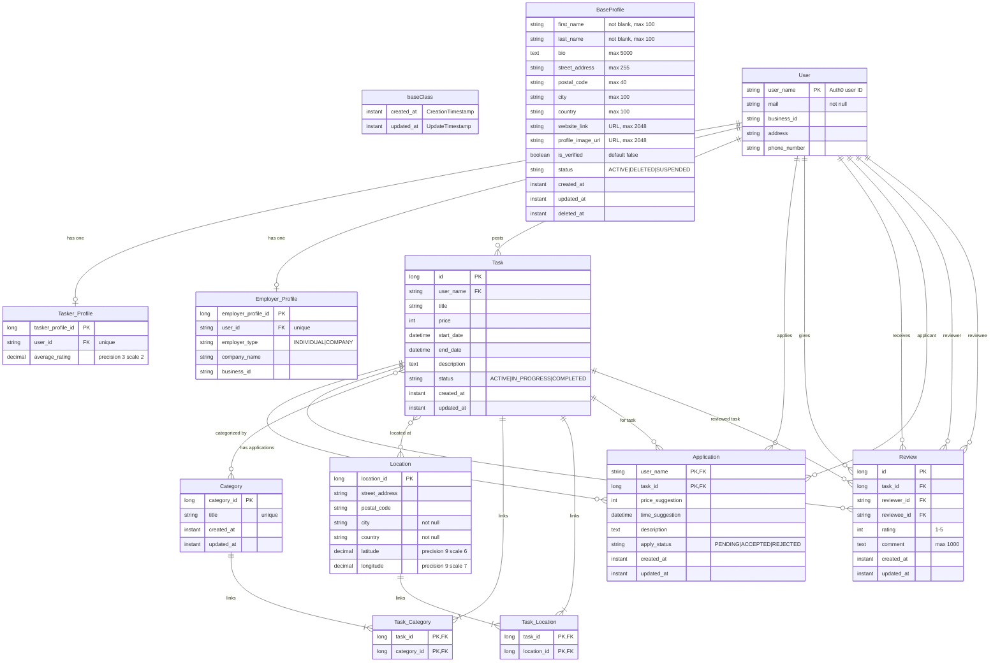

# Gig-Based Job Platform

This project is a desktop-first (mobile-optimized) application designed to connect individuals seeking help ("Employers") with skilled individuals looking for work ("Taskers"). The platform facilitates the entire process from posting a job to secure payment and feedback.

## Core Features

The application is built around two primary user roles: the Employer and the Tasker.

### For Employers
* **Post & Manage Gigs:** Easily create new job listings with detailed descriptions, categories (e.g., yard work, cleaning, small repairs), a fixed price, and location. Employers can view and manage their active and archived job posts.
* **Review & Hire Applicants:** Receive notifications for new applicants. Browse applicant profiles, which include star ratings and written feedback from previous jobs, and hire the best candidate for the task.
* **Secure Payment System:** When a Tasker is hired, the payment is held in escrow. This assures the Tasker that the funds are available. The payment is released with a single click once the Employer confirms the job is completed.
* **Rate & Review Taskers:** After a job is complete, employers can leave a 1-5 star rating and public feedback, which is added to the Tasker's profile.

### For Taskers
* **Build Your Profile:** Create and maintain a public profile to showcase skills and expertise. The profile automatically builds a work history with all completed jobs and reviews from Employers.
* **Find & Apply for Gigs:** Browse all available jobs in a list or map view. Use powerful search and filter functions based on keywords, category, distance, and price to find suitable work.
* **Track Applications:** Keep track of all job applications and their status (Pending, Approved, Rejected) in a personal dashboard.
* **Track Your Earnings:** Receive payments instantly to your in-app balance after a job is marked as complete. View a comprehensive history of all earnings.

## Technology Stack


## Entity-Relationship Diagram (ERD)

The following ERD shows the current database design structure and the logical relationships between entities.

## Swagger-UI

When you run Java-application on localhost, you can find api-documentation in this address:
[Swagger-ui](http://localhost:8080/swagger-ui/index.html#/)

## Backend

Java version 17.0.12

**MacOS & Windows**  
Terminal commands:

```bash
cd glig
```

```bash
./mvnw spring-boot:run
```

## Authors
* Aku Ihamuotila
* Tuomas Jaakkola
* Jani Könönen
* Tuomas Leinonen
* Markus Mäntylä
