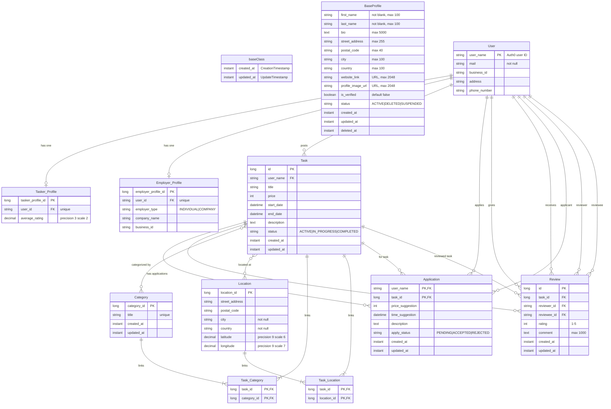

<div align="center">

# Gig-Based Job Platform

A full-stack web application connecting people who need help with tasks ("Employers") with skilled individuals looking for work ("Taskers"). The platform facilitates the entire workflow from job posting to completion, payment, and feedback.

[](https://worker-application.netlify.app/)
[](https://github.com/JTTAM-Projects/worker/issues)
[](https://github.com/JTTAM-Projects/worker/stargazers)

[View Demo](https://worker-application.netlify.app/) · [Report Bug](https://github.com/JTTAM-Projects/worker/issues) · [Request Feature](https://github.com/JTTAM-Projects/worker/issues)

</div>

---

## 📋 Table of Contents
- [About The Project](#about-the-project)
- [Core Features](#-core-features)
- [Technology Stack](#-technology-stack)
- [Database Structure](#-entity-relationship-diagram-erd)
- [Getting Started](#-getting-started)
- [Testing](#-testing)
- [API Documentation](#-api-documentation)
- [Live Demo](#-live-demo)
- [Security](#-security-considerations)
- [Known Issues](#-known-issues--limitations)
- [Roadmap](#-future-enhancements)
- [Deployment](#-deployment)
- [Contributing](#-contributing)
- [Authors](#-authors)
- [License](#-license)
- [Acknowledgments](#-acknowledgments)

---

## About The Project

This gig-based job platform was developed as part of Haaga-Helia University of Applied Sciences' Software Project II course. The application addresses the need for a streamlined platform where individuals can easily find help with everyday tasks while providing skilled workers with opportunities to earn income.

**Why this project?**
- Connects task posters with skilled workers in a secure environment
- Simplifies the entire workflow from job posting to payment
- Provides reputation system through ratings and reviews
- Offers flexible work opportunities for taskers

The platform supports two distinct user journeys - one for those seeking help (Employers) and another for those offering services (Taskers), with Auth0-powered authentication ensuring secure access.

## 🚀 Core Features

The application supports two primary user roles: **Employer** and **Tasker**.

### For Employers
* **Post & Manage Tasks:** Create job listings with descriptions, categories (e.g., cleaning, yard work, repairs), fixed prices, and locations. Manage active and completed tasks from your dashboard.
* **Review & Hire Applicants:** Receive applications from interested Taskers. Browse applicant profiles with ratings and reviews from previous jobs, then hire the best candidate.
* **Secure Payment System:** Payments are held in escrow when a Tasker is hired, ensuring funds are available. Release payment with one click after confirming job completion.
* **Rate & Review Taskers:** Leave 1-5 star ratings and written feedback after job completion, building the Tasker's reputation.

### For Taskers
* **Build Your Profile:** Create a professional profile showcasing your skills. Automatically track your work history with completed jobs and employer reviews.
* **Find & Apply for Tasks:** Browse available jobs in list or map view. Search and filter by keywords, category, location radius, and price range.
* **Track Applications:** Monitor all your applications and their status (Pending, Accepted, Rejected) in a personal dashboard.
* **Manage Your Work:** View accepted tasks, track in-progress work, and mark jobs as complete.

## 🛠 Technology Stack

### Backend


### Frontend


### Key Libraries & Tools
- **Authentication:** Auth0 (OAuth 2.0)
- **ORM:** Hibernate / Spring Data JPA
- **State Management:** TanStack Query (React Query)
- **Form Handling:** TanStack Form
- **Mapping:** Google Maps API
- **API Documentation:** Swagger/OpenAPI
- **Testing:** JUnit, Mockito, Spring Boot Test

## 📊 Entity-Relationship Diagram (ERD)

The following ERD illustrates the database structure and relationships between entities:



### Database Notes
- **Base Classes:** `baseClass` and `BaseProfile` are `@MappedSuperclass` entities providing common fields to child entities
- **Composite Keys:** Application uses a composite primary key (user_name + task_id)
- **Many-to-Many:** Task-Category and Task-Location relationships use join tables
- **Soft Deletes:** Profiles use soft deletion with `deleted_at` timestamp
- **Constraints:** Review has unique constraint on (task_id, reviewer_id) and check constraint (rating 1-5, reviewer ≠ reviewee)

## 🚀 Getting Started

### Prerequisites
- **Java 21** (JDK 21.0.5 or later)
- **Node.js 18+** and npm
- **Maven 3.8+**
- **Auth0 Account** (for authentication)

### Backend Setup

1. **Navigate to backend directory:**
   ```bash
   cd backend/glig
   ```

2. **Configure application properties:**
   - Development uses H2 in-memory database (configured in `application-dev.yml`)
   - Update Auth0 settings in `application.yml`:
     ```yaml
     okta:
       oauth2:
         issuer: https://your-auth0-domain.auth0.com/
         audience: https://your-api-audience
     ```

3. **Run the application:**
   ```bash
   ./mvnw spring-boot:run
   ```

4. **Access Swagger UI:**
   - API Documentation: http://localhost:8080/swagger-ui/index.html
   - H2 Console: http://localhost:8080/h2-console

### Frontend Setup

1. **Navigate to frontend directory:**
   ```bash
   cd frontend/workerfrontend
   ```

2. **Install dependencies:**
   ```bash
   npm install
   ```

3. **Configure environment variables:**
   Create a `.env` file:
   ```env
   VITE_API_URL=http://localhost:8080/api
   VITE_AUTH_DOMAIN=your-auth0-domain.auth0.com
   VITE_AUTH_CLIENT_ID=your-auth0-client-id
   VITE_AUTH_AUDIENCE=https://your-api-audience
   VITE_GOOGLE_MAPS_API_KEY=your-google-maps-api-key
   ```

4. **Start development server:**
   ```bash
   npm run dev
   ```

5. **Access the application:**
   - Frontend: http://localhost:5173

## 🧪 Testing

### Backend Tests
```bash
cd backend/glig
./mvnw test
```

### Build for Production
```bash
# Backend
cd backend/glig
./mvnw clean install

# Frontend
cd frontend/workerfrontend
npm run build
```

## 📝 API Documentation

The REST API is documented using Swagger/OpenAPI. When running locally, access the interactive API documentation at:
- **Swagger UI:** http://localhost:8080/swagger-ui/index.html
- **OpenAPI JSON:** http://localhost:8080/v3/api-docs

## 🔐 Authentication

The application uses **Auth0** for secure authentication and authorization:
- OAuth 2.0 / OIDC protocol
- JWT token-based authentication
- Separate user roles (Employer/Tasker determined by profile creation)

## 📂 Project Structure

```
worker/
├── backend/
│   └── glig/                 # Spring Boot application
│       ├── src/
│       │   ├── main/
│       │   │   ├── java/
│       │   │   │   └── com/jttam/glig/
│       │   │   │       ├── domain/           # Domain entities & logic
│       │   │   │       ├── review/           # Review module
│       │   │   │       ├── configuration/    # Spring configuration
│       │   │   │       └── exception/        # Exception handling
│       │   │   └── resources/
│       │   │       └── application*.yml      # Configuration files
│       │   └── test/                         # Unit & integration tests
│       ├── pom.xml
│       └── mvnw
│
└── frontend/
    └── workerfrontend/       # React + TypeScript application
        ├── src/
        │   ├── features/             # Feature modules
        │   ├── pages/                # Page components
        │   ├── routes/               # TanStack Router routes
        │   ├── ui-library/           # Reusable UI components
        │   ├── auth/                 # Auth0 configuration
        │   └── main.tsx              # Application entry point
        ├── package.json
        └── vite.config.ts
```

## 🌐 Live Demo

**Live Application:** [https://worker-application.netlify.app/](https://worker-application.netlify.app/)

**Test Credentials:**
- Username: `test`
- Password: `Test@123`

**Note:** The application uses Auth0 authentication. After logging in, you can explore both Employer and Tasker functionalities depending on which profile you create.

<p align="right">(<a href="#table-of-contents">back to top</a>)</p>

## 🔒 Security Considerations

### Implemented Security Measures
- **Authentication:** OAuth 2.0 via Auth0 with JWT tokens
- **Authorization:** Role-based access control (Employer/Tasker profiles)
- **Input Validation:** Server-side validation using Bean Validation (Jakarta)
- **SQL Injection Protection:** JPA/Hibernate with parameterized queries
- **XSS Protection:** React's built-in XSS protection
- **CORS Configuration:** Currently allows all origins (should be restricted to specific domains in production)
- **Environment Variables:** Sensitive data stored in `.env` files (not in version control)

### Security Checklist
- [x] API keys and secrets removed from version control
- [x] Environment variables properly configured
- [x] Database uses strong authentication (Auth0 managed)
- [x] HTTPS enabled in production (Heroku/Netlify)
- [ ] CORS should be restricted to specific origins for production security
- [ ] Database backup strategy to be defined

### Known Security Limitations
- Development mode uses H2 in-memory database with default credentials (not for production)
- **CORS Security:** Backend currently allows all origins (`*`). For production security, this should be restricted to specific domains (e.g., `https://worker-application.netlify.app`)

<p align="right">(<a href="#table-of-contents">back to top</a>)</p>

## 🐛 Known Issues & Limitations

For a complete list of known issues and planned improvements, see [GitHub Issues](https://github.com/JTTAM-Projects/worker/issues).

### Current Limitations
1. **Payment System:** Payment integration is not yet implemented (Paytrail integration planned)
2. **Real-time Notifications:** Not yet implemented
3. **Mobile Responsiveness:** Optimized for desktop, mobile improvements planned
4. **Image Upload:** Profile images use URLs only (no file upload yet)
5. **Search Performance:** May be slow with large datasets due to missing database indexing (currently relies on pagination)

### Planned Features
See [GitHub Issues](https://github.com/JTTAM-Projects/worker/issues) for detailed feature requests and enhancements.

<p align="right">(<a href="#table-of-contents">back to top</a>)</p>

## 📈 Roadmap

- [ ] Real-time messaging system between Employers and Taskers
- [ ] Actual payment gateway integration (Paytrail)
- [ ] Push notifications for new applications and job updates
- [ ] Database indexing for improved search performance
- [ ] Mobile application (React Native)
- [ ] Multi-language support (i18n)
- [ ] Analytics dashboard for users
- [ ] Restrict CORS to specific production domains
- [ ] Advanced filtering and sorting options
- [ ] Email notifications for task updates

See the [open issues](https://github.com/JTTAM-Projects/worker/issues) for a full list of proposed features and known issues.

<p align="right">(<a href="#table-of-contents">back to top</a>)</p>

## 🧪 Testing Coverage

### Backend Tests
- Unit tests for service layer
- Integration tests for API endpoints

### Frontend Tests
- To be implemented

Run tests:
```bash
# Backend
cd backend/glig
./mvnw test

# Generate coverage report
./mvnw test jacoco:report
```

<p align="right">(<a href="#table-of-contents">back to top</a>)</p>

## 🚀 Deployment

### Deployment Architecture
- **Backend:** Hosted on Heroku with PostgreSQL database
- **Frontend:** Hosted on Netlify
- **Authentication:** Auth0
- **Maps:** Google Maps API

### Deployment Steps

**Backend (Heroku):**
1. Configure production database connection
2. Set environment variables in Heroku dashboard
3. Connect GitHub repository to Heroku
4. Enable automatic deployments from `main` branch

**Frontend (Netlify):**
1. Build frontend: `npm run build`
2. Connect GitHub repository to Netlify
3. Configure build settings and environment variables
4. Enable automatic deployments from `main` branch

### Environment Variables for Production

**Backend (Heroku Config Vars):**
```env
DATABASE_URL=postgresql://[host]:[port]/[database]?user=[username]&password=[password]
SPRING_PROFILES_ACTIVE=prod
```

**Application Configuration (application.yml):**
```yaml
okta:
  oauth2:
    issuer: https://jk-projects.eu.auth0.com/
    audience: https://glig.com
```

**Frontend (Netlify Environment Variables):**
```env
VITE_API_URL=https://your-heroku-app.herokuapp.com/api
VITE_AUTH_DOMAIN=jk-projects.eu.auth0.com
VITE_AUTH_CLIENT_ID=your-auth0-client-id
VITE_AUTH_AUDIENCE=https://glig.com
VITE_GOOGLE_MAPS_API_KEY=your-google-maps-api-key
```

<p align="right">(<a href="#table-of-contents">back to top</a>)</p>

## 📚 Documentation

### API Documentation
- **Swagger UI:** Available at `/swagger-ui/index.html` when running locally
- **OpenAPI Spec:** Available at `/v3/api-docs`

### Code Documentation
- Backend: JavaDoc comments on public APIs
- Frontend: TSDoc comments on complex components and utilities

### Architecture Decisions
Key architectural decisions are documented in code comments and this README.

<p align="right">(<a href="#table-of-contents">back to top</a>)</p>

## 🤝 Contributing

This is an academic project for Haaga-Helia University of Applied Sciences. While the repository is public for educational purposes, it is not currently accepting external contributions.

### For Team Members

Contributions from team members are what make this project successful. If you have a suggestion that would improve the project, please follow these steps:

1. Create a feature branch from `dev`
   ```bash
   git checkout -b feature/AmazingFeature
   ```
2. Make your changes and commit them
   ```bash
   git commit -m 'Add some AmazingFeature'
   ```
3. Write/update tests for your changes
4. Push to the branch
   ```bash
   git push origin feature/AmazingFeature
   ```
5. Submit a pull request to `dev`
6. Ensure all tests pass and code review is approved

<p align="right">(<a href="#table-of-contents">back to top</a>)</p>

## 📄 License

This project is created for educational purposes as part of Haaga-Helia University of Applied Sciences' Software Project II course.

All rights reserved. This project is not licensed for public use, modification, or distribution outside of its educational context.

<p align="right">(<a href="#table-of-contents">back to top</a>)</p>

## 🙏 Acknowledgments

This project wouldn't have been possible without the following resources and support:

* [Haaga-Helia University of Applied Sciences](https://www.haaga-helia.fi/) - Educational institution and project sponsor
* Course instructors and mentors for their guidance
* [Auth0](https://auth0.com/) - Authentication and authorization platform
* [Google Maps Platform](https://developers.google.com/maps) - Location services
* [Spring Boot Documentation](https://spring.io/projects/spring-boot)
* [React Documentation](https://react.dev/)
* [TanStack Query](https://tanstack.com/query/latest) - Powerful asynchronous state management
* [Tailwind CSS](https://tailwindcss.com/) - Utility-first CSS framework
* [Best-README-Template](https://github.com/othneildrew/Best-README-Template) - README inspiration
* [Img Shields](https://shields.io/) - README badges
* [GitHub Pages](https://pages.github.com/) - Documentation hosting

<p align="right">(<a href="#table-of-contents">back to top</a>)</p>

## 📞 Contact

**Project Repository:** [https://github.com/JTTAM-Projects/worker](https://github.com/JTTAM-Projects/worker)

**Report Issues:** [https://github.com/JTTAM-Projects/worker/issues](https://github.com/JTTAM-Projects/worker/issues)

**Team Members:**
- Aku Ihamuotila - Developer
- Tuomas Jaakkola - Developer  
- Jani Könönen - Developer
- Tuomas Leinonen - Developer
- Markus Mäntylä - Developer

<p align="right">(<a href="#table-of-contents">back to top</a>)</p>

---

<div align="center">

*Last Updated: November 2025*  
*Project Status: In Development*

Made with ❤️ by JTTAM-Projects Team

</div>
