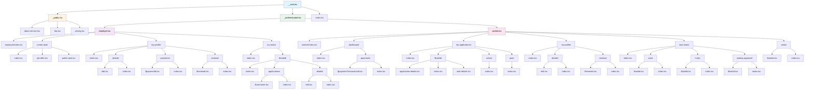

## Reittihierarkia

```mermaid
graph TD
    Root[__root.tsx]

    Root --> Public[_public.tsx]
    Root --> Auth[_authenticated.tsx]
    Root --> Index[index.tsx]

    Public --> AboutService[about-service.tsx]
    Public --> FAQ[faq.tsx]
    Public --> Pricing[pricing.tsx]

    Auth --> Employer[employer.tsx]
    Auth --> Worker[worker.tsx]

    Employer --> EmpIndex[employer/index.tsx]
    Employer --> CreateTask[create-task/]
    Employer --> MyProfile1[my-profile/]
    Employer --> MyTasks[my-tasks/]

    CreateTask --> CTIndex[index.tsx]
    CreateTask --> JobOffer[job-offer.tsx]
    CreateTask --> PublicTask[public-task.tsx]

    MyProfile1 --> MP1Index[index.tsx]
    MyProfile1 --> MP1Details[details/]
    MyProfile1 --> MP1Payments[payments/]
    MyProfile1 --> MP1Reviews[reviews/]

    MP1Details --> MP1DEdit[edit.tsx]
    MP1Details --> MP1DIndex[index.tsx]

    MP1Payments --> MP1PPaymentId[$paymentId.tsx]
    MP1Payments --> MP1PIndex[index.tsx]

    MP1Reviews --> MP1RReviewId[$reviewId.tsx]
    MP1Reviews --> MP1RIndex[index.tsx]

    MyTasks --> MTIndex[index.tsx]
    MyTasks --> MTTaskId[$taskId/]

    MTTaskId --> MTTIndex[index.tsx]
    MTTaskId --> MTTApps[applications/]
    MTTaskId --> MTTDetails[details/]

    MTTApps --> MTTAUsername[$username.tsx]
    MTTApps --> MTTAIndex[index.tsx]

    MTTDetails --> MTTDEdit[edit.tsx]
    MTTDetails --> MTTDIndex[index.tsx]

    Worker --> WorkerIndex[worker/index.tsx]
    Worker --> Dashboard[dashboard/]
    Worker --> MyApps[my-applications/]
    Worker --> MyProfile2[my-profile/]
    Worker --> OwnTasks[own-tasks/]
    Worker --> Tasks[tasks/]

    Dashboard --> DIndex[index.tsx]
    Dashboard --> DPayments[payments/]

    DPayments --> DPTransactionId[$paymentTransactionId.tsx]
    DPayments --> DPIndex[index.tsx]

    MyApps --> MAIndex[index.tsx]
    MyApps --> MATaskId[$taskId/]
    MyApps --> MAActive[active/]
    MyApps --> MAPast[past/]

    MATaskId --> MATAppDetails[application-details.tsx]
    MATaskId --> MATIndex[index.tsx]
    MATaskId --> MATTaskDetails[task-details.tsx]

    MAActive --> MAAIndex[index.tsx]
    MAPast --> MAPIndex[index.tsx]

    MyProfile2 --> MP2Index[index.tsx]
    MyProfile2 --> MP2Details[details/]
    MyProfile2 --> MP2Reviews[reviews/]

    MP2Details --> MP2DEdit[edit.tsx]
    MP2Details --> MP2DIndex[index.tsx]

    MP2Reviews --> MP2RReviewId[$reviewId.tsx]
    MP2Reviews --> MP2RIndex[index.tsx]

    OwnTasks --> OTIndex[index.tsx]
    OwnTasks --> OTPast[past/]
    OwnTasks --> OTToDo[to-do/]
    OwnTasks --> OTWaiting[waiting-approval/]

    OTPast --> OTPTaskId[$taskId.tsx]
    OTPast --> OTPIndex[index.tsx]

    OTToDo --> OTTTaskId[$taskId.tsx]
    OTToDo --> OTTIndex[index.tsx]

    OTWaiting --> OTWTaskId[$taskId.tsx]
    OTWaiting --> OTWIndex[index.tsx]

    Tasks --> TTaskId[$taskId.tsx]
    Tasks --> TIndex[index.tsx]

    style Root fill:#e1f5ff,color:#000
    style Public fill:#fff4e1,color:#000
    style Auth fill:#e8f5e9,color:#000
    style Employer fill:#f3e5f5,color:#000
    style Worker fill:#fce4ec,color:#000
```
